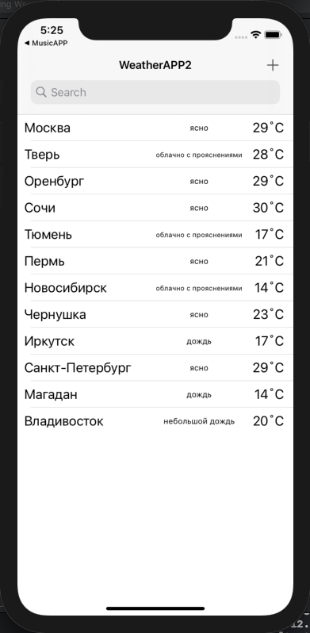
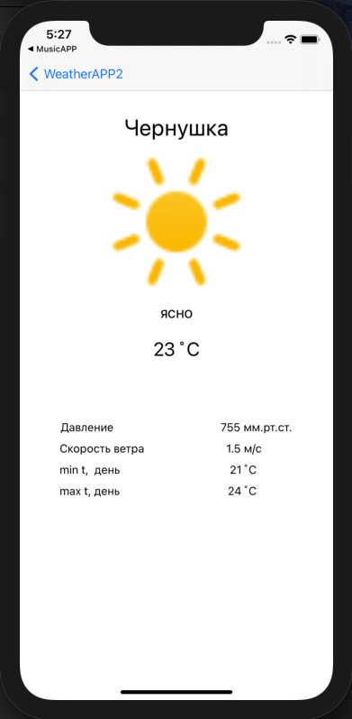

# WeatherAPP2
___
## Оглавление
- **[Описание](#Description)**
- **[Презентация](#Presentation)**

## Описание
Погодное приложение. Учебный проект.

- Проект написан на **UIKit**
- Верстка интерфейса **Storyboard**
- Получение данных **REST API** + **Parse JSON**
- Дополнительные поды **SVGKit** 

___

## Презентация
### Основной экран

### Экран подробной информации

### Работа приложения

___

